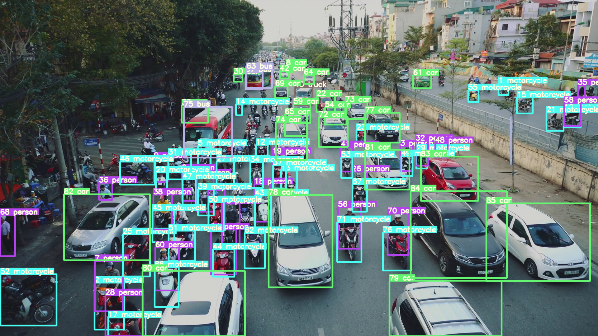
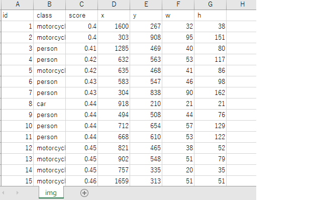
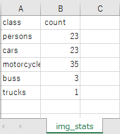
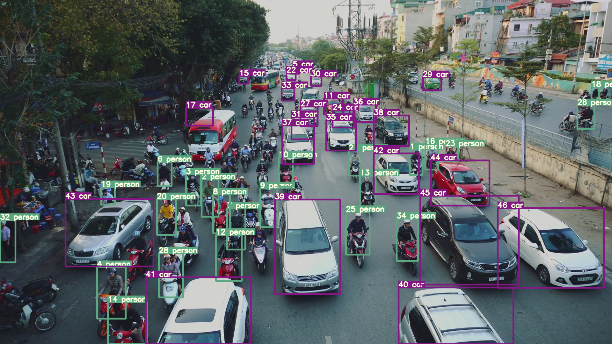
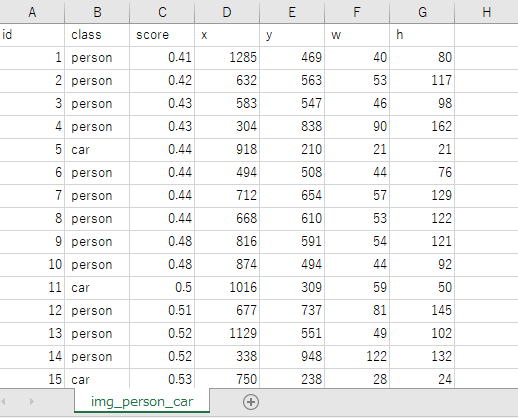
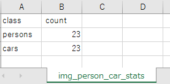

<html>
<body>
<h1>Yolov5ObjectDetector</h1>
<b>
This is a simple python class Yolov5ObjectDetector based on yolov5/detect.py implementation
on https://github.com/ultralytics/yolov5. 
</b>
 
<h2>1 Installation </h2>
<h3>
1.1 Yolov5ObjectDetector
</h3>

 We have downloaded <a href="https://github.com/ultralytics/yolov5">yolov5</a>.
and installed pytorch-cpu and tochvision-cpu in the following way. 

 
<table style="border: 1px solid red;">
<tr><td>

git clone https://github.com/ultralytics/yolov5.git 
cd yolov5 

pip install -r requirements.txt

</td></tr>
</table>
 

Please download Yolov5ObjectDetector.git from https://github.com/atlan-antillia/Yolov5ObjectDetector repository to your working folder.  

somewhere>git clone https://github.com/atlan-antillia/Yolov5ObjectDetector.git 
cd Yolov5ObjectDetector 
 
Yo may see the following files in the Yolov5ObjectDetector: 
 
FiltersParser.py 
Yolov5ObjectDetector.py 
images/ 
output/ 
yolov5m.pt 

Please copy these files to yolov5 folder.  

<h3>
1.2 How to run Yolov5ObjectDetector
</h3>

Please run the following command. 

yolov5>python Yolov5ObjectDetector.py input_image_file_or_dir  output_image_dir [optional_filters]
 
 
<b>
Example 1: 
yolov5>python Yolov5ObjectDetector.py images\img.png output  
</b>
 The above command will generate a triplet of files (detected_objects_image, detected objects_detail, detected_objects_stats), 
 and save them as the output diretory. 

output/img.png 

 
 

ouput/img.csv 

 
 
output/img_stats.csv 

 
 
<b>
Example 2: filers=[person,car] 
</b>
yolov5>python Yolov5ObjectDetector.py images\img.png output [person,car] 
output/img_person_car.png 

 
 

 
 

ouput/img_person_car.csv 

 
 
output/img_person_car_stats.csv 

 
 

</body>
</html>

